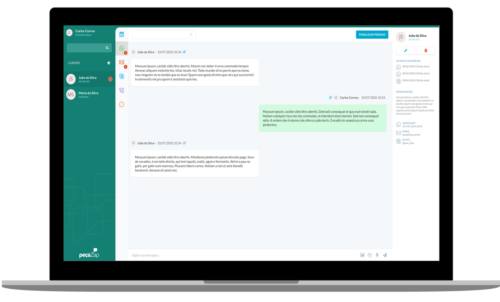

<h1 align="center">PeçaZap</h1>


<p align="center">
  

  
  
  <a href="https://github.com/KZTN/Desafio_Vulcanet_parte_2/commits/master">
    
  </a>

  <a href="https://github.com/KZTN/Desafio_Vulcanet_parte_2/issues">
    
  </a>

  
</p>

<p align="center">
  
</p>


## ℹ️  Informações

Este é um desafio que faz parte do recrutamento da Vulcanet. O projeto já está finalizado e funcional.

## 🔌 Base url 

Todas chamadas devem usar a url base:
```
https://my-json-server.typicode.com/matheuscampanhaf/api-challenge
```
A API está usando o pacote Cors, isso permite o acesso de qualquer Interface (frontend), desde que a mesma seja direcionada para a porta adequada.
